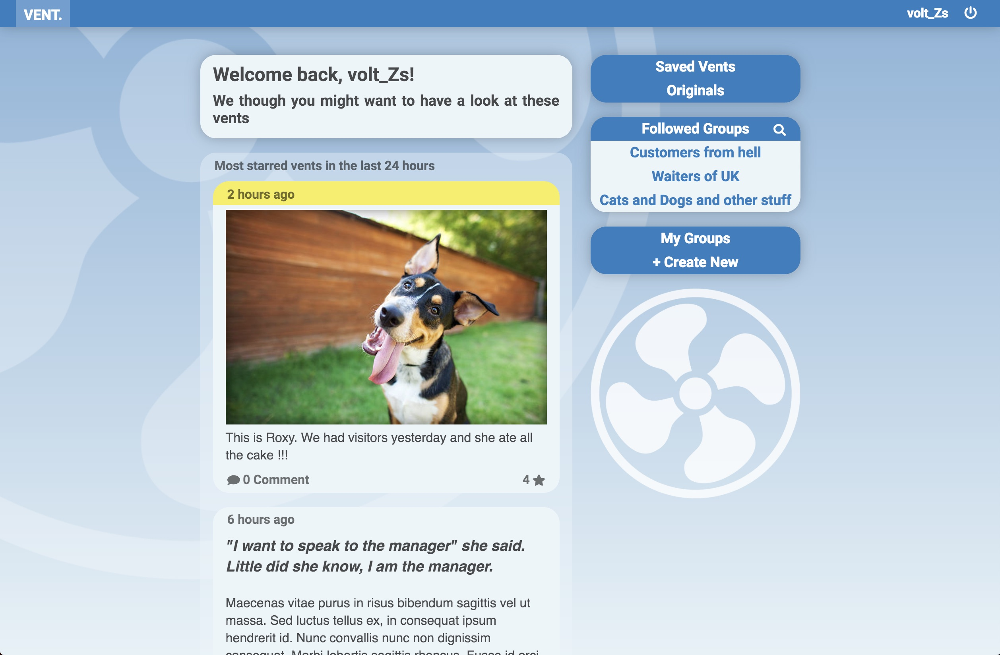

# varga_zsolt_set08101_coursework2
Coursework part 2 for SET08101 (Web Technologies)

To get the server running, follow these steps:
  1. Clone repo and navigare inside the directory from your terminal
  2. In the terminal run: npm install (this will install all node packages
    specified in the package.json file).
  3. Start your mongodb server.
  4. run: node app.js

The website should now be accessible on localhost port 3000.

## More about the application and the development process can be found in vent-report.pdf

